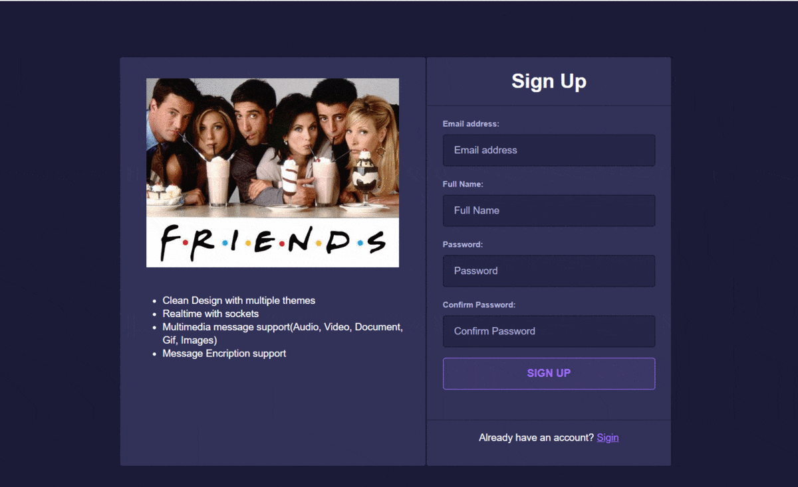
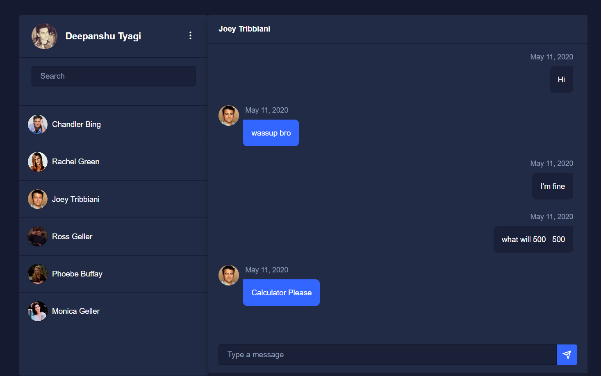
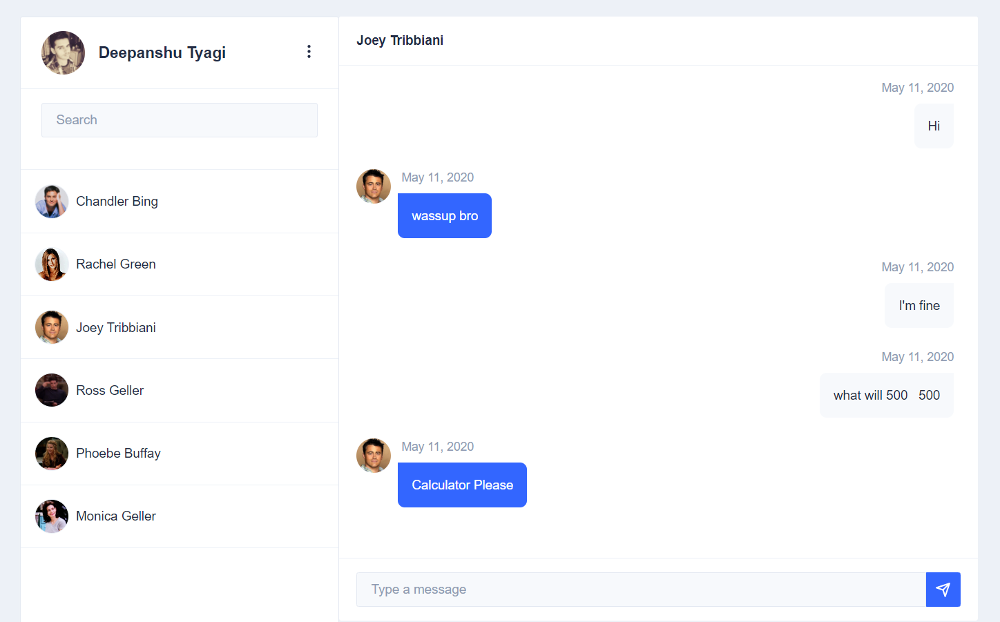

# Spring Angular Chat(STOMP)

1-1 instant messaging project designed to demonstrate WebSockets in a load-balanced environment. Users can register, login/logout, see a friendslist, private message all in realtime. WebSocket usages include user presence monitoring, notifications, and chat messages.

## Technologies/Design Decisions

- Backend: Kotlin with Spring Boot
- Frontend: Angular 8
- Message Broker: RabbitMQ (PubSub pattern for multi-server messaging)
- Database: MongoDB
- ORM: Spring Data
- WebSocket messaging protocol: Stomp
- WebSocket handler: Sock.js (with cross-browser fallbacks)
- Security: Spring Security
- Spring Controllers couple REST as well as WebSocket traffic
- Solid Design Principals.

## Features

- OAUTH2 with Google and Facebook. Users can also register via email.
- Multiple color themes available.
- Private Friends list with blocking unwanted users.
- Messages are persisted. Pwa is available provide desktop application features.
- Offline message support and sync when user is online.
- Easy add new friends via email. Like WhatsApp add via Phone number.
- Chat support Images, Audio, Video, Gif's, Map Location. Multiple files with drop in feature.

## Themes

### Default Theme

### Dark Theme

### Light Theme

## Screenshots

- [Signin Screen](./images/signin.png)
- [Signup Screen](./images/signin.png)
- [Oauth2 Confirmation](./images/token.png)
- [Home Screen](./images/home.png)
- [Chat](./images/chat.png)
- [Add New Friend](./images/new_friend.png)
- [Edit Profile](./images.edit-profile.png)
